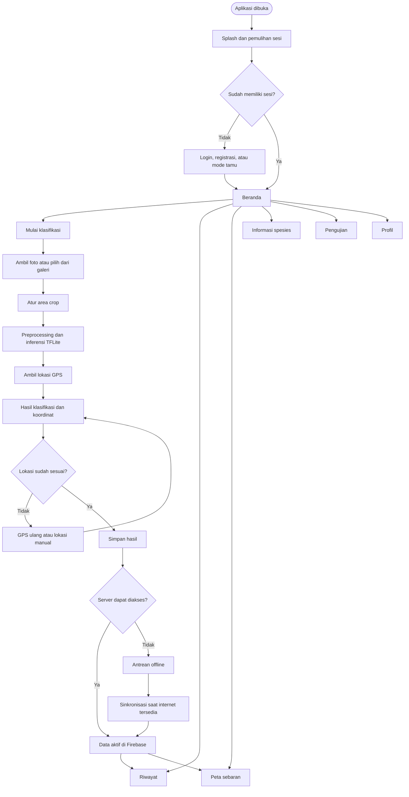
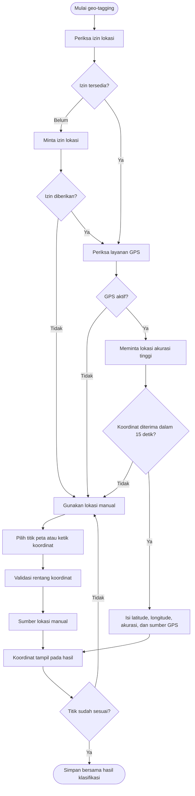
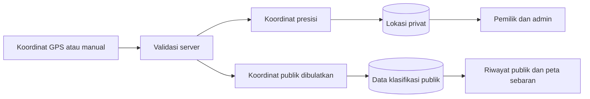

# Alur Aplikasi dan Geo-tagging iHoya

Dokumen ini menjelaskan alur aplikasi iHoya secara keseluruhan dan proses geo-tagging berdasarkan implementasi aplikasi saat ini.

## 1. Alur aplikasi secara keseluruhan

### Prosedur umum

1. Pengguna membuka aplikasi dan menunggu proses splash serta pemulihan sesi akun.
2. Jika belum memiliki sesi, pengguna masuk menggunakan email, Google, mendaftar akun baru, atau menggunakan mode tamu.
3. Setelah autentikasi, aplikasi menampilkan beranda.
4. Dari beranda, pengguna dapat membuka:
   - klasifikasi Hoya;
   - riwayat klasifikasi;
   - peta sebaran;
   - informasi spesies;
   - pengujian perangkat dan geo-tagging; atau
   - profil pengguna.
5. Pada proses klasifikasi, pengguna mengambil foto atau memilih gambar dari galeri, mengatur area crop, lalu aplikasi menjalankan model TensorFlow Lite.
6. Aplikasi mencoba mengambil lokasi GPS dan menampilkan hasil prediksi beserta koordinat.
7. Pengguna dapat memperbaiki lokasi menggunakan GPS ulang, memilih titik pada peta, atau mengetik koordinat.
8. Hasil disimpan ke Firebase. Jika pembuatan data server gagal karena koneksi, data dapat dimasukkan ke antrean offline untuk disinkronkan saat internet tersedia.
9. Data yang telah aktif ditampilkan pada riwayat dan peta sebaran.

### Flowchart keseluruhan

## 2. Alur geo-tagging

Geo-tagging dilakukan setelah foto selesai diproses oleh model. Lokasi dapat diperoleh otomatis melalui GPS atau ditentukan secara manual oleh pengguna.

### Prosedur GPS otomatis

1. Aplikasi memeriksa izin lokasi.
2. Jika izin belum diberikan, aplikasi meminta izin kepada pengguna.
3. Jika izin ditolak, lokasi otomatis tidak tersedia dan pengguna dapat memilih lokasi manual.
4. Jika izin diberikan, aplikasi memeriksa apakah layanan lokasi perangkat aktif.
5. Aplikasi meminta koordinat dengan akurasi tinggi dan batas waktu 15 detik.
6. Jika berhasil, aplikasi memperoleh latitude, longitude, akurasi horizontal, dan sumber lokasi `gps`.
7. Koordinat ditampilkan pada halaman hasil klasifikasi.

### Prosedur lokasi manual

Jika GPS tidak tersedia atau titiknya kurang tepat, pengguna dapat:

1. menekan **GPS** untuk mengambil ulang lokasi;
2. menekan **Pilih di Map**, mengetuk titik yang sesuai, lalu menekan **Simpan**; atau
3. mengisi latitude dan longitude, kemudian menekan **Gunakan Koordinat**.

Lokasi yang dipilih melalui peta atau diketik diberi sumber `manual`. Pada halaman hasil saat ini, latitude harus berada pada rentang `-90` sampai `90`, sedangkan longitude harus berada pada rentang `-180` sampai `180`.

### Flowchart geo-tagging

## 3. Penyimpanan dan privasi lokasi

Saat hasil disimpan, server memvalidasi koordinat dan membentuk dua jenis lokasi:

- **Lokasi presisi**, disimpan pada subkoleksi privat dan hanya dapat dibaca oleh pemilik data serta admin.
- **Lokasi publik**, dibulatkan sebelum digunakan pada riwayat publik dan peta sebaran.

Nilai fallback pembulatan adalah dua angka desimal untuk spesies umum dan satu angka desimal untuk spesies langka. Tujuannya adalah mengurangi ketepatan lokasi yang ditampilkan kepada publik, terutama untuk spesies langka.

## 4. Ringkasan alur geo-tagging

Secara singkat, foto diproses terlebih dahulu, kemudian aplikasi mencoba memperoleh GPS. Pengguna memeriksa atau memperbaiki koordinat, lalu lokasi disimpan bersama hasil klasifikasi. Koordinat presisi dilindungi, sedangkan tampilan publik menggunakan koordinat yang telah dibulatkan.
